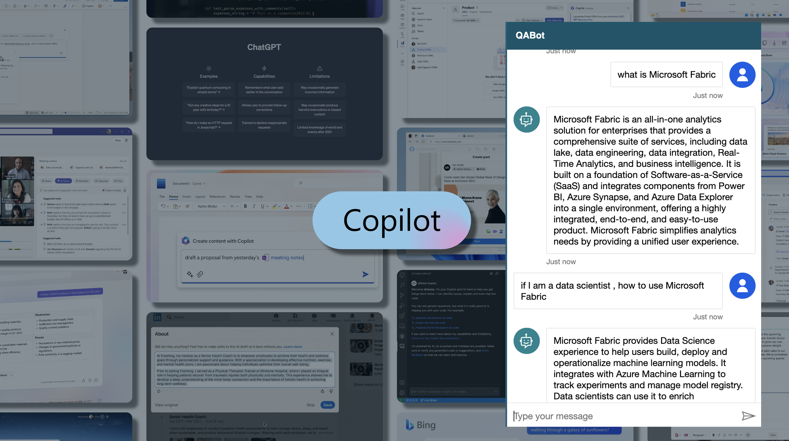
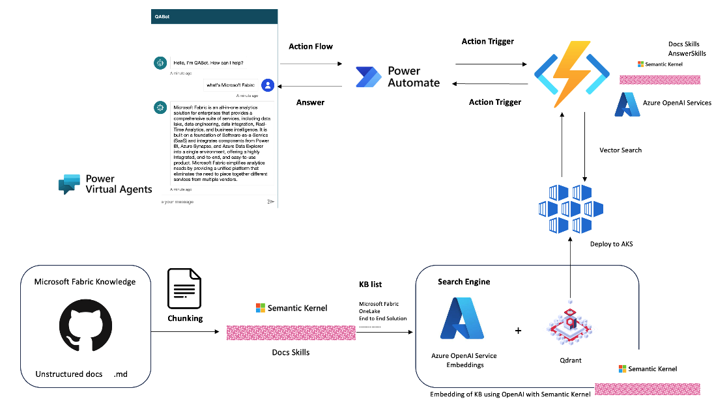

# **🫵 创建 Microsoft Fabric Copilot 应用 Workshop**

## **📡 什么是 Microsoft Fabric ?**

Microsoft Fabric 是一款面向企业的一体化分析解决方案，涵盖从数据移动到数据科学、实时分析和商业智能的所有内容。 它提供一整套服务，包括数据湖、数据工程和数据集成，全部集中在一个地方。

使用 Fabric，您无需将多个供应商的不同服务拼凑在一起。 相反，您可以享受高度集成、端到端且易于使用的产品，该产品旨在简化您的分析需求。

该平台建立在软件即服务 (SaaS) 的基础上，它将简单性和集成性提升到了一个全新的水平。

## **🔥 为初学者创建 Microsoft Fabric Copilot 应用程序**

Copilot 应用程序可以作为您日常工作中的辅助工具，解决不同的问题。 Microsoft Fabric是一个全新的产品，各界人士都想了解它。 公众在与Copilot交流的过程中，可以了解Microsoft Fabric的适用场景、基本术语以及相关示例。

## **🔥 创建方法**

这里面有很多有趣的点，我们分几步来解释一下

1. Microsoft Fabric 是一个全新的产品，微软在 Microsoft Docs 和 Microsoft Learn 中发布了丰富的内容。 但 Azure OpenAI Service 的模型数据有限，并没有新知识点的 Microsoft Fabric。 我们通过 Azure OpenAI 服务上的 text-embedding-ada-002 模型结合 GitHub 中的 Microsoft Learn markdown 文件以向量嵌入的形式向 gpt-35-turbo 模型添加新的知识点。

2. Microsoft Fabric 有很多术语，我们知道它涉及到很多文档和知识，我们需要选择一个向量数据库来进行相关存储。 这里我选择Qdrant，因为它是一种成本相对较低的入门级技术解决方案，可以直接部署在云端，也可以通过容器部署在本地。

3. 或者你会关注项目中的 Prompt，它利用 Prompt来 提取知识并根据问题组织答案。 实验一会有详细解答

4. Semantic Kernel 是 LLM 的开源框架，支持Python、.NET、Java、Typescript 等技术。 让开发者或者 Prompt 工程师更好的实现大型模型项目

5. 通过Azure Function 作为后端服务通过 AKS 和 API 支持部署 Qdrant 的数据库。

6. Chat的实现是利用 Power Virtual Agent完成的。 在 Power Virtual Agent 中，我们通过 Power Automate 调用 Azure Function 的 API 来完成 QA

这是架构

## **🔥 关于 Workshop**

该 Workshop 含有四个实验

**🧪 实验准备 - 设置你的 GitHub Codespaces**

在开始实验之前，我们必须完成相关的开发环境配置。 GitHub Codespaces 是您最好的合作伙伴。 通过 GitHub Codespaces，我们可以跨设备、在任何浏览器下访问它。 我们更容易完成开源项目的维护和学习。 通过实验准备的学习，您将学习如何基于 GitHub Codespaces 构建 Copilot 应用程序开发环境。

⏰ *时间 : 45 min - 60 min*

🔗 *学习 : 点击 [该链接](./labs/cn/lab0/README.md)*

**🧪  实验一 - 构建你的 Copilot 应用原型**

如何将基于 Microsoft Learn 的 Microsoft Fabric 文档导入 ChatGPT 来构建 Copilot 应用程序？ 我们使用 Semantic Kernel 进行原型设计，使用 .NET Polyglot Notebooks 进行 Qdrant

⏰ *时间 : 45 min - 60 min*

🔗 *学习 : 点击 [该链接](./labs/cn/lab1/README.md)*

**🧪  实验二 - 部署到云端**

在现代应用程序中，我们离不开云原生应用程序。 在实验二中，我们为 Copilot 应用程序配置后端。 我们需要结合 Azure 上的 Azure Kubernetes Service 和Azure Function 来完成相关后端的使用

⏰ *时间 :  45 min - 60 min*

🔗 *学习 : 点击 [该链接](./labs/cn/lab2/README.md)*

**🧪 实验三 - 通过 Power Virtual Agent 创建聊天机器人**

使用低代码 Power Virtual Agent 和 Power Automate 构建 Copilot 的前端交互

⏰ *时间 :  45 min - 60 min*

🔗 *学习 : 点击 [该链接](./labs/cn/lab3/README.md)*

## **🔥 准备工作**

1. **.NET 7+** https://dotnet.microsoft.com/en-us/
   
2. **Azure** 

免费获取 Microsoft Azure https://azure.com/free 

如果你是学生 ,可以申请 Azure for Student https://aka.ms/studentgetazure 

3. **Microsoft 365**

获取试用 https://learn.microsoft.com/en-us/power-virtual-agents/sign-up-individual

4. **GitHub Codespaces**

https://github.com/features/codespaces

## **🔥 相关资源**

1. 学习关于 Azure OpenAI Service https://learn.microsoft.com/en-us/azure/cognitive-services/openai/overview

2. 学习关于 Azure Kubernetes Service https://learn.microsoft.com/en-us/azure/aks/intro-kubernetes

3. 学习关于 Azure Function Service https://learn.microsoft.com/en-us/azure/azure-functions/functions-overview?pivots=programming-language-csharp

4. 学习关于 Semantic Kernel https://learn.microsoft.com/en-us/semantic-kernel/overview/

5. 学习关于 Power Virtual Agent https://learn.microsoft.com/en-us/power-virtual-agents/fundamentals-what-is-power-virtual-agents

6. 学习关于 Qdrant https://qdrant.tech/documentation/

