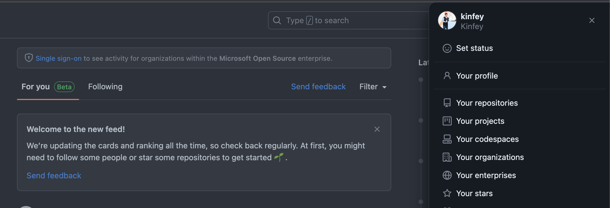
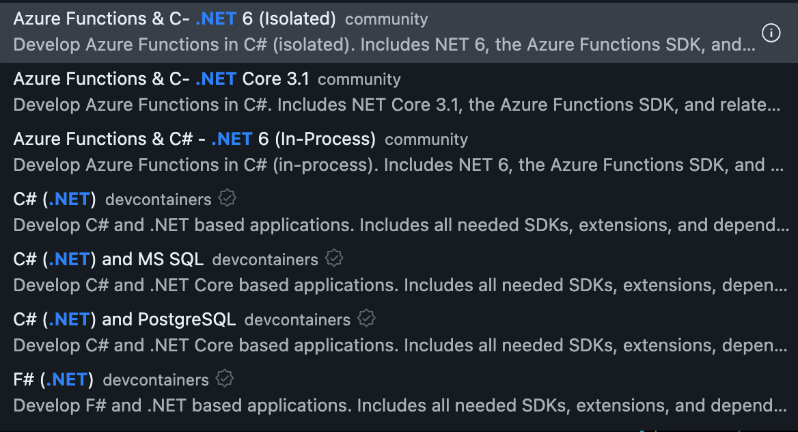
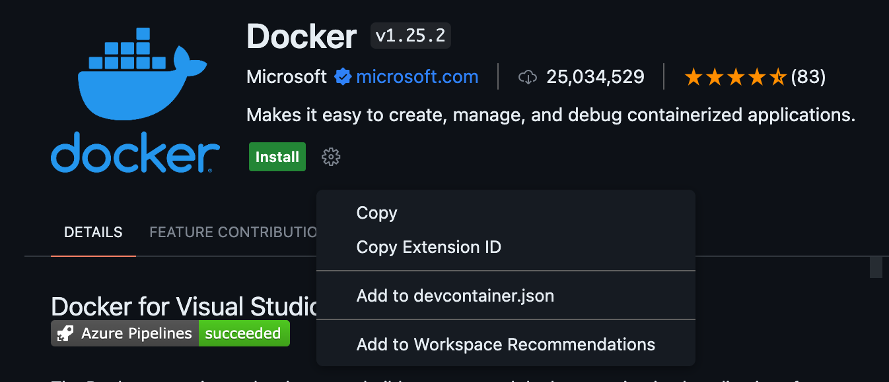
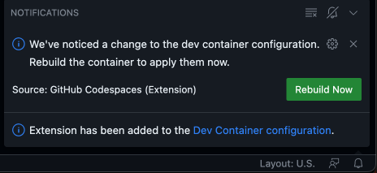

# **🧪 实验准备 - 设置你的 GitHub Codespaces**

在开始我们的实验之前，我们需要使用 GitHub Codespaces 配置环境

## **🧰 GitHub Codespaces**

代码空间是托管在云中的开发环境。 您可以通过将配置文件提交到存储库（通常称为配置即代码）来自定义 GitHub Codespaces 项目，这会为项目的所有用户创建可重复的代码空间配置。

您创建的每个代码空间均由 GitHub 托管在 Docker 容器中，并在虚拟机上运行。 您可以从多种虚拟机类型中进行选择，包括 2 核、8 GB RAM 和 32 GB 存储，最多 32 核、64 GB RAM 和 128 GB 存储。

### **开始设置你的 GitHub Codespaces**


1. 登录 [GitHub Portal](https://github.com/)

   **注意:** 如果你没有 GitHub 账号，请 [注册](https://github.com/signup)


2. 单击门户右上角的个人资料照片，然后从展开的菜单中选择“Your codespaces”




3. 选择 Blank template


4. 使用 'Ctrl+Shift+P' ( Windows / Linux ) 或 'Cmd+Shift+P' ( macOS) 选择 ' Codespaces : Add Dev Containers Cogiguration Files ...'


   再选择 'Create a new configuration'


5. 设置 C# (.NET) devcontainers
   


   选择 7.0 
   


1. 在你的开发容器中选择 Azure CLI , Azure Functions Core Tools , Docker  , 选择 OK 和 'Keep defaults' 

2. 添加 your devcontainer.json

**.NET 插件包**


**Azure Tools 插件**


**Azure Functions 插件**


**Docker 插件**



**Thunder Client 插件**


**Polyglot Notebooks 插件**


*注意:*  请检查你的 devcontainer.json 

```json

{
	"name": "C# (.NET)",
	// Or use a Dockerfile or Docker Compose file. More info: https://containers.dev/guide/dockerfile
	"image": "mcr.microsoft.com/devcontainers/dotnet:0-7.0",
	"features": {
		"ghcr.io/devcontainers/features/azure-cli:1": {},
		"ghcr.io/devcontainers/features/docker-in-docker:2": {},
		"ghcr.io/jlaundry/devcontainer-features/azure-functions-core-tools:1": {}
	},
	"customizations": {
		"vscode": {
			"extensions": [
				"ms-vscode.vscode-node-azure-pack",
				"ms-dotnettools.vscode-dotnet-runtime",
				"ms-azuretools.vscode-docker",
				"rangav.vscode-thunder-client",
				"ms-azuretools.vscode-azurefunctions",
				"ms-dotnettools.dotnet-interactive-vscode"
			]
		}
	}
}


```

8. 选择 Rebuild 你的 codespaces 开发容器
   


1. Rebuild 后 'Ctrl+Shift+P' ( Windows / Linux ) 或 'Cmd+Shift+P' ( macOS) 再选择 ' Codespaces : Change Machine Type'
   


调整你的配置 '4 cores,8 GB RAM, 32 GB Storage'
   


重启你的机器
   


## **🔁 继续学习**

恭喜恭喜 🎊🎊🎊! 你已经完成基本环境的配置，可以进入到实验一


## **🪵 相关资源**

了解更多 [GitHub Codespaces](https://docs.github.com/en/codespaces/overview)


