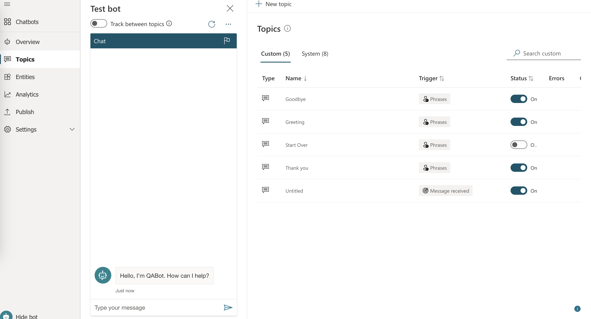
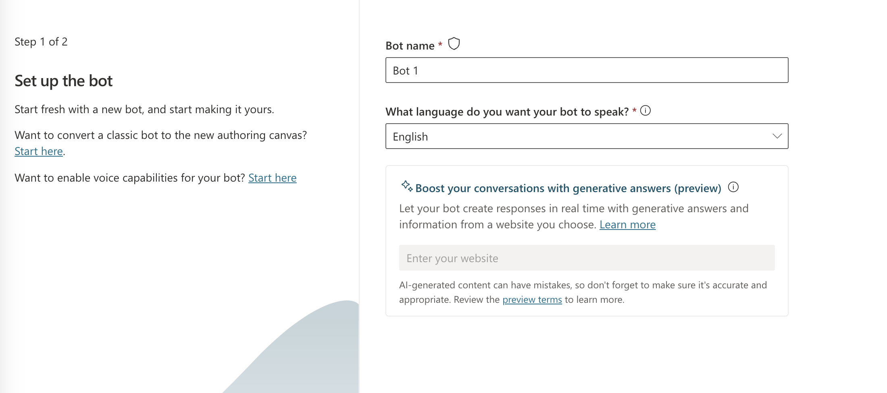
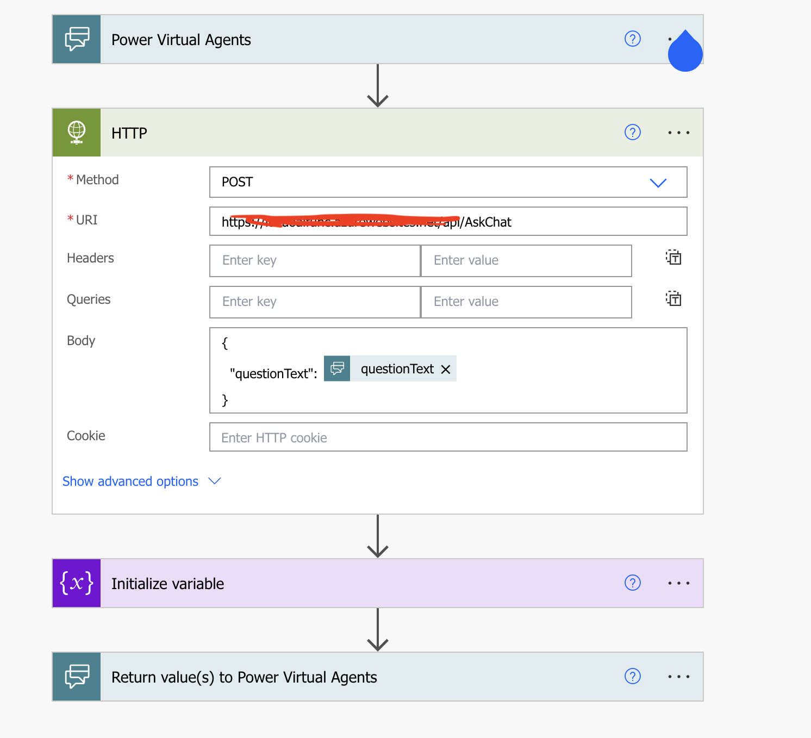
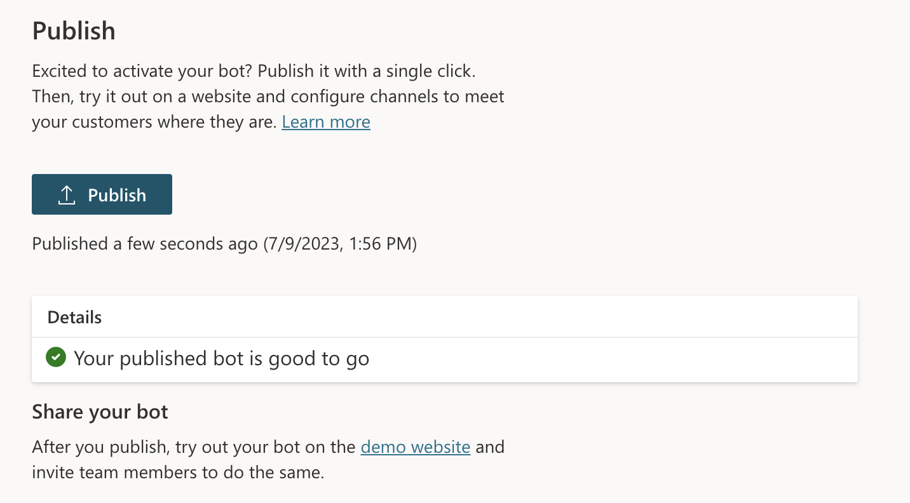
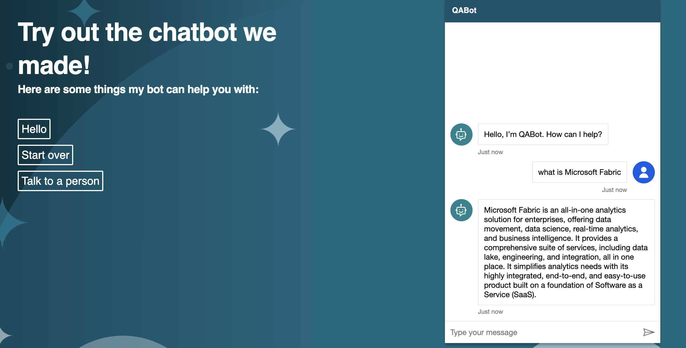

# **🧪 实验三 - 通过 Power Virtual Agent 创建聊天机器人**

我们在实验二中完成了后端的搭建，实验三是我们的前端，也就是前端 Chatbot 的交互工作。

## **Power Virtual Agent**

Power Virtual Agents 可让您创建强大的 AI 驱动的聊天机器人，以满足一系列请求 - 从提供常见问题的简单答案到解决需要复杂对话的问题。 通过网站、移动应用、Facebook、Microsoft Teams 或 Azure Bot Framework 支持的任何渠道以多种语言与客户和员工互动。

***Note*** 如果你希望使用 PVA ， 请 [注册](https://go.microsoft.com/fwlink/?LinkId=2107702)

## ***🏃‍♂️ Let‘s go***

1. 打开你的 PVA Portal , 创建 Chatbot

2. 选择名字和语言 (默认选择英语)

   稍等片刻 , 进入到你的 PVA 应用

3. 进入 Topics

   创建新的 Topic , 你可以看到 Chatbot Flow

   你需要把 Flow 设定成如下的内容

***Note*** PVA Flow 不能直接调用 Azure Function API  , 需要依赖 Power Automate

4. 保存所有设定, 在你的 PVA portal 测试你的 Chatbot

5. 最后在你的 PVA Portal 发布你的第一个 Copilot 应用

## **😊😊😊 恭喜!!**

你的第一个 Copilot 应用已经完成

## **🔥 相关资源**

1. 学习 [Power Virtual Agent](https://learn.microsoft.com/en-us/power-virtual-agents/)

