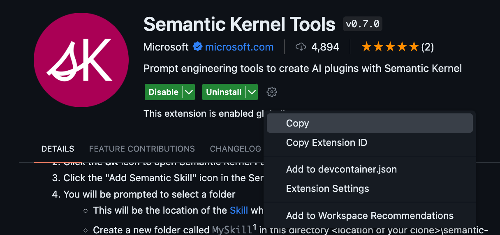
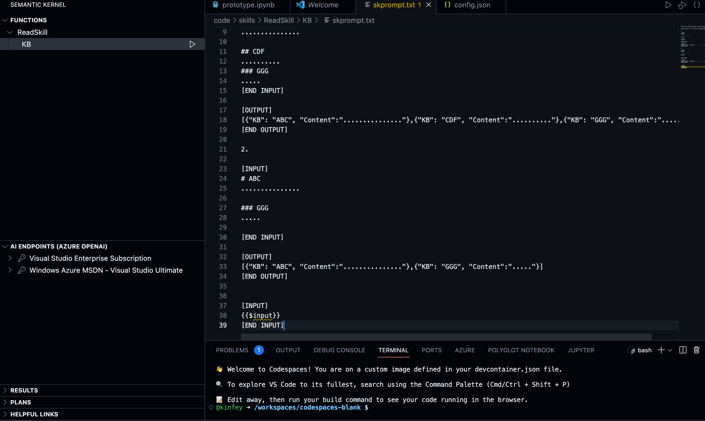
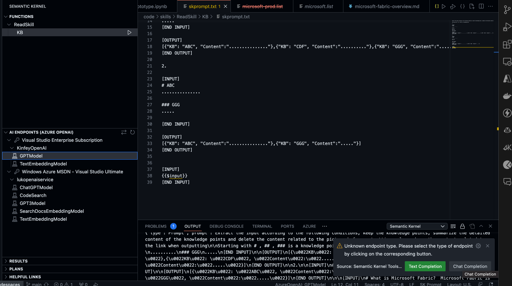

# **🧪  Lab 1 - Prototype**

## **📚 Story**

With the arrival of a new AI era, multimodal models have human-like thinking. pass 
Prompt guidance can be generated through these multi-modal models to construct different content. Microsoft Build 2023 Microsoft proposed the Copilot application technology stack based on Azure OpenAI Service, allowing individuals and enterprises to easily build interactive Copilot applications.


We hope that the multimodal model of Azure OpenAI Service has more knowledge, such as data in the enterprise, new knowledge, and time-sensitive news. Unfortunately our model training is based on constant time knowledge. We need to add our own data or new knowledge to the model, which is basically done by knowledge embedding in the industry。

In Lab 1, we will extract the knowledge points of Microsoft Fabric based on Azure OpenAI Service and complete a basic prototype, hoping to give you some inspiration.Let's go 😏


## **🍔  Why I choose Semantic Kernel**

To engineer Azure OpenAI Service to complete Copilot applications, we need some frameworks. Currently popular frameworks on the market include LangChain and Semantic Kernel.

### **🧰 LangChain**

[LangChain](https://github.com/hwchase17/langchain) is a framework for developing applications powered by language models. It enables applications that are:

*Data-aware:* connect a language model to other sources of data

*Agentic:* allow a language model to interact with its environment

The main value props of LangChain are:

1. Components: abstractions for working with language models, along with a collection of implementations for each abstraction. Components are modular and easy-to-use, whether you are using the rest of the LangChain framework or not

2. Off-the-shelf chains: a structured assembly of components for accomplishing specific higher-level tasks

Off-the-shelf chains make it easy to get started. For more complex applications and nuanced use-cases, components make it easy to customize existing chains or build new ones.

### **🧰 Semantic Kernel**

[Semantic Kernel](https://github.com/microsoft/semantic-kernel) is an open-source SDK that lets you easily combine AI services like OpenAI, Azure OpenAI, and Hugging Face with conventional programming languages like C# and Python. By doing so, you can create AI apps that combine the best of both worlds.

Semantic Kernel has been engineered to allow developers to flexibly integrate AI services into their existing apps. To do so, Semantic Kernel provides a set of connectors that make it easy to add memories and models. In this way, Semantic Kernel is able to add a simulated "brain" to your app.

### **LangChain 🆚 Semantic Kernel**

Both LangChain and Semantic Kernel are open source projects. LangChain has a relatively long development time and supports more libraries and application scenarios than Semantic Kernel. However, Semantic Kernel supports more programming languages than Python and JS supported by LangChain, and also supports Java, C#, etc. And compared to LangChain, it is better in combining prompt and programming language. Better support for adding Azure OpenAI Services to legacy projects. Semantic Kernel is more friendly to non-machine learning engineers, and it is easier for the development team to transition to AI-oriented programming.


*Note:*  <u>This lab is  based on Semantic Kernel 0.17.230704.3-preview and .NET 7+</u>


## **🚪 Basic Concept**


### **Get Microsoft Fabric Docs**

We want the Copilot application to learn our knowledge of Microsoft Fabric, first of all we need to have the documentation of Microsoft Fabric. We can get all the original markdown files through the GitHub Repo corresponding to Microsoft Learn


**🗄️ Get your Data**

Open terminal , Create folder - code , clone Microsoft Fabric Repo under code folder

```bash

mkdir code && cd code

git clone https://github.com/MicrosoftDocs/fabric-docs.git

```

1. In folder - code , use GitHub Codespaces to create prototype.ipynb file , Select Kernel '.NET Interactive'


*Note:*  If you haven't configured GitHub Codespaces please go back to [Lab 0](../lab0/README.md)


**🔍 Understand your Data**

Before prototyping, we need to understand the unstructured data we download, which is very beneficial to our work.

We hope that every knowledge point about Microsoft Fabric can be mastered by the model on Azure OpenAI Service. But what to do with unstructured content is a key. We found some patterns in the markdown we downloaded. For example, there are files described in the file header (author, time, abstract, etc.), and knowledge points are represented by #, ##, ### in markdown format, or we can write promp in this way Let the large model in Azure OpenAI Service help us extract relevant details


At this time, we can easily define some data rules, or we need a JSON to save these extracted knowledge points ， like:

[{"kb":"What is Microsoft Fabric?","content":"......."},{"kb":"....","content":"..."}]


**🤖 Using Your Azure OpenAI Service**

Azure OpenAI Service integrates different OpenAI large models, and now GA has GPT-3, ChatGPT, Codex, DALL-E, which are integrated with Azure's enterprise functions. Let enterprises be safer and more reliable in the process of using large models


If you want to use Azure OpenAI Service, in addition to needing an Azure account, also need to apply. This experiment requires gpt-35-turbo-16k and text-embedding-ada-002, so you only need to click [this link](https://customervoice.microsoft.com/Pages/ResponsePage.aspx?id=v4j5cvGGr0GRqy180BHbR7en2Ais5pxKtso_Pz4b1_xUOFA5Qk1UWDRBMjg0WFhPMkIzTzhKQ1dWNyQlQCN0PWcu) to apply (about 1-2 working days passed 🤗🤗🤗), as for GPT-4, it is relatively difficult to apply 😥😥😥😥.

If you want to know how to use the model on Azure OpenAI Service please use this [link](https://learn.microsoft.com/en-us/azure/cognitive-services/openai/how-to/create-resource?pivots=web-portal)


**💬  Prompt engineering**

Before this step, we have completed the download and data relationship about Microsoft Fabric. At this time, we need to write some prompts to extract data. So how do we do the Prompt project? Azure AI Studio's Playground can help. But here I introduce the Visual Studio Code extension using Semantic Kernel. It is more suitable for our test of completing the Prompt project



1. Create skills folder inside code folder

2. Create ReadSkill folder in skills

3. Create KB folder in ReadSkill

In Semantic Kernel, different Prompts are called Skills, and we can invoke the operations of Prompts by calling different [Skills]( https://github.com/microsoft/semantic-kernel/blob/main/docs/SKILLS.md ). A skill refers to a domain of expertise made available to the kernel as a single function, or as a group of functions related to the skill. The design of SK skills has prioritized maximum flexibility for the developer to be both lightweight and extensible.


The prompt and parameter settings of each skill are placed in the folder of each specific skill. The file corresponding to the prompt is skprompt.txt, and the file for parameter settings is config.json.


Let Prompt extract the content of markdown, which is actually the same as human thinking. According to the above content and understanding, we get the following Prompt (skprompt.txt)

```txt

Extract the input according to the following conditions, keep the knowledge points, summarize the detailed content of the knowledge points and delete the content related to the picture before outputting, please keep the content related to the link when outputting

Starting with # , ## , ### is a knowledge point

1.

[INPUT]
# ABC
...............

## CDF 
..........
### GGG
.....
[END INPUT]

[OUTPUT]
[{"KB": "ABC", "Content":"..............."},{"KB": "CDF", "Content":".........."},{"KB": "GGG", "Content":"....."}]
[END OUTPUT]

2.

[INPUT]
# ABC
...............

### GGG
.....

[END INPUT]

[OUTPUT]
[{"KB": "ABC", "Content":"..............."},{"KB": "GGG", "Content":"....."}]
[END OUTPUT]


[INPUT]
{{$input}}
[END INPUT]

```

and parameter settings (config.json)


```json

{
    "schema": 1,
    "type": "completion",
    "description": "Get KB Content",
    "completion": {
      "max_tokens": 13000,
      "temperature": 0.0
    }
}

```

4. Select the extension of Semantic Kernel, and log in your corresponding Azure account




Select the Azure OpenAI Endpoint corresponding to the subscription, as well as the model and method to test




Click Run，the inputbox will pop up


Input this text

```txt

# What is Microsoft Fabric?

Microsoft Fabric is an all-in-one analytics solution for enterprises that covers everything from data movement to data science, Real-Time Analytics, and business intelligence. It offers a comprehensive suite of services, including data lake, data engineering, and data integration, all in one place.

```

it will show the result in terminal


*Note:*  

1. Semantic Kernel Extension is still in preview, so there will be different problems when using it, please use it with caution

2. Semantic Kernel Extension  depends on .NET 6, please run it directly on the command line


```bash

sudo apt-get install -y dotnet-sdk-6.0

```


**🧠 Embeddings**


An embedding is a special format of data representation that can be easily utilized by machine learning models and algorithms. The embedding is an information dense representation of the semantic meaning of a piece of text. Each embedding is a vector of floating point numbers, such that the distance between two embeddings in the vector space is correlated with semantic similarity between two inputs in the original format. For example, if two texts are similar, then their vector representations should also be similar. To learn more about Embeddings, visit this [link](https://learn.microsoft.com/en-us/azure/cognitive-services/openai/how-to/embeddings?tabs=console)

There are many vector databases on the market to assist us in the embedded work. Here I chose [Qdrant](https://qdrant.tech/), but you can also choose a different vector database scheme, such as Pinecone

***Install & Run Qdrant in GitHub Codespaces***


```bash

docker pull qdrant/qdrant

docker run -p 6333:6333 qdrant/qdrant

```


## **🎬 Let's Start**


Please Click [notebook](../../code/lab1/prototype.ipynb)  to learn 


## **🔁 Continue**

After the prototype is successfully built, you will find that teaching AI professional knowledge is a very simple matter. Congratulations on becoming an AI mentor!


