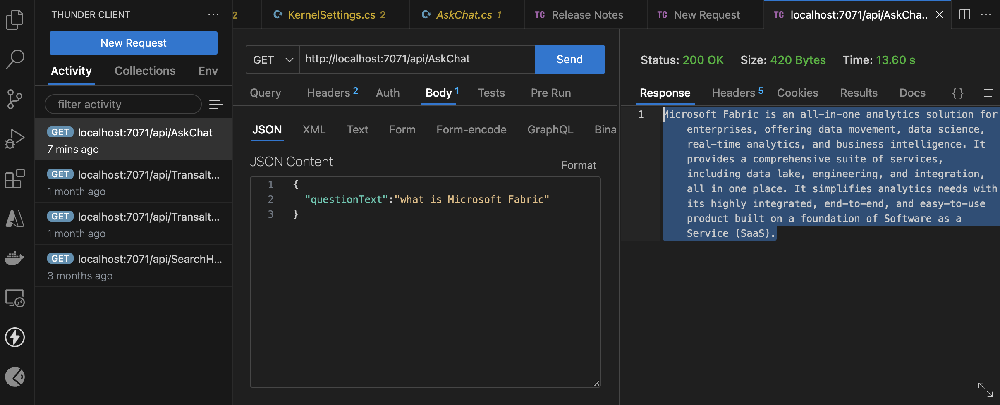

# **🧪  Lab 2 - Deploy to Cloud**

We created a prototype of Microsoft Fabric in Lab 1 with Semantic Kernel and Qdrant. At this time, we need to implement the development of the Copilot application. At this time, we need to combine cloud applications to realize it. There is no doubt that Microsoft Azure will be the focus of Lab 2.

## **☁️ Introduce Cloud Native**

Cloud native applications are built from the ground up—optimized for cloud scale and performance. They’re based on microservices architectures, use managed services, and take advantage of continuous delivery to achieve reliability and faster time to market.

In Copilot applications, we can fully integrate with cloud-native applications. In Lab 1, Qdrant is used locally in the form of containers, and we can deploy it in combination with Azure Kubernetes Service. For the interaction with the knowledge base, we can also publish it as a Serverless API through Azure Function.


## **Deploy Qdrant in Azure Kubernetes Service**

### **What is Azure Kubernetes Service**

Azure Kubernetes Service (AKS) simplifies deploying a managed Kubernetes cluster in Azure by offloading the operational overhead to Azure. As a hosted Kubernetes service, Azure handles critical tasks, like health monitoring and maintenance. When you create an AKS cluster, a control plane is automatically created and configured. This control plane is provided at no cost as a managed Azure resource abstracted from the user. You only pay for and manage the nodes attached to the AKS cluster.

### **Deploy**

***Prerequirement***

1. Install Azure CLI [https://learn.microsoft.com/en-us/cli/azure/install-azure-cli](https://learn.microsoft.com/en-us/cli/azure/install-azure-cli)

2. Install Heml [https://helm.sh/docs/intro/install/](https://helm.sh/docs/intro/install/)

3. Apply [Azure](https://azure.com/free)  or [Azure For Student](https://aka.ms/studentgetazure)


***Let's Go***

1. Clone GitHub Repo git clone https://github.com/Azure-Samples/qdrant-azure.git

2. In Termianl 

```bash
   
   az login

   az account set --subscription "Your Subscription"

   az group create --name "Azure Resource Group" --location "Azure Region"

   az sshkey create --name "qdrantSSHKey" --resource-group "AIGroup"

```

3. Click go to [AKS](https://portal.azure.com/#create/Microsoft.Template/uri/https%3A%2F%2Fraw.githubusercontent.com%2FAzure-Samples%2Fqdrant-azure%2Fmain%2FAzure-Kubernetes-Svc%2Faks-arm-deploy.json)

4. Follow this to finish AKS settings


5. In Terminal


```bash

kubectl get nodes

cd YourQdrantOnAzureFolder/Azure-Kubernetes-Svc

helm install azqdrant-sk ./qdrant-on-azure --create-namespace

```

6. Check your Qdrant on Azure , In terminal


```bash

kubectl get services

```


7. The covered red part is the public address of our Qdrant on Azure. Congratulations, you have successfully deployed your Qdrant on Azure in the cloud. You can re-run the Notebook after modifying the Qdrant address connected to the Lab 1 Notebook Kernel


```csharp

IKernel kernel = Kernel.Builder
            .WithAzureChatCompletionService("Your Deplpyment model name", "Azure OpenAI Endpoint", "Azure OpenAI Key")
            .WithAzureTextEmbeddingGenerationService("Your Deplpyment model name", "Azure OpenAI Endpoint", "Azure OpenAI Key")
            .WithQdrantMemoryStore("http://YourQdrantonAzureIP:6333", 1536)
            .Build();

```


## **Azure Function**

Azure Functions is a serverless solution that allows you to write less code, maintain less infrastructure, and save on costs. Instead of worrying about deploying and maintaining servers, the cloud infrastructure provides all the up-to-date resources needed to keep your applications running.

As shown in the above architecture diagram, we use Serverless as the interactive API of Copilot

***Let‘s go***

1. Go to ./code/lab2/MSFabricBots

2. Change MSFabricBots.Funcs/appsettings.json in your Codespaces

```json

{
    "AzureOpenAI": {
      "deployName": "Your GPT-3 ModelName",
      "endpoint": "Your Azure Endpoint",
      "apiKey": "Your Azure OpenAI Key",
      "embeddingDeployName": "Your Embedding Endpoint",
      "vectorDBEndpoint": "http://YourAKSEndPoint:6333",
      "memoryCollectionName":"fbkb-concept"
    }
}

```

3. Open Terminal 


```bash

cd ./code/lab2/MSFabricBots/MSFabricBots.Funcs

func host start

```

4. Open your GitHub Codepsaces Thunder Client Extension 




 


